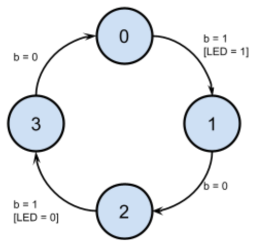
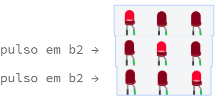

# atividade sobre MEF(Máquinas de Estados Finitos)

## 1 - Reduzir esse diagrama para 2 estados

### codigo
    switch (buttonState) {
        case 1:
            if (previousButtonState == 0) {
                ledState = !ledState;
            }
            break;

        default:
            break;
        }
[codigo Completo](ex1.ino)

## 2 - Esqueça o LED… Faça um programa para imprimir o número de vezes que o botão foi pressionado.

### codigo
    int buttonActionCounter(int buttonCounter) {
        buttonCounter++ ;
        Serial.print("[+] voce clicou ");
        Serial.print(buttonCounter);
        Serial.println(" vezes");
        return buttonCounter;
    }
[codigo Completo](ex2.ino)

## 3 - Considere agora o Arduino com 2 botões e 3 LEDS:
Faça um programa para acender somente 1 LED de cada vez, onde um pulso no botão 1 desloca o LED aceso para a esquerda, e o botão 2 desloca para a direita.

### codigo
    buttonRightState = digitalRead(buttonRight);
    buttonLeftState = digitalRead(buttonLeft);
 
    if (buttonRightState && !previousButtonRightState && currentLED <= numberLEDs) {
        currentLED++ ;
    } else if (currentLED > numberLEDs ) {
        currentLED = 1;
    }
 
    if (buttonLeftState && !previousButtonLeftState && currentLED > 0) {
        currentLED-- ;
    } else if (currentLED <= 0 ) {
        currentLED = numberLEDs;
    }
[codigo Completo](ex3.ino)

